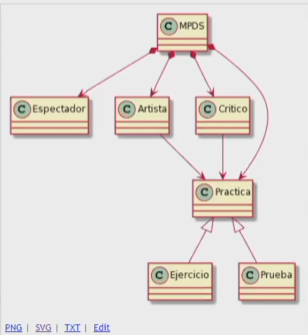

# Prueba Patrones-UML

## Cuestionario de la Prueba Patrones-UML

1. Determina la corrección de los siguientes enunciados. En caso incorrecto, justifica la respuesta:
   * "la identidad identifica al ente o a la entidad";
   * "el identificador identifica al ente o entidad de cierta identidad";
   * "la entidad del ente es el identificador de la identidad"

   ### Mis respuestas
   
   * "la identidad es el conjunto de valores o rasgos que identifican al ente o entidad"
   * "el identificador es el nombre o valor que nos permite identificar al ente o entidad de cierta entidad"
   * "La entidad o ente, son la misma cosa, son sinonimos. Si acaso son identificadores de algo más, de alguna otra cosa"

   ### Respuestas correctas o vistas en clase.
   
   * El enunciado uno es incorrecto. La identidad no identifica nada.
   * El enunciado 2 es correcto.
   * El enunciado 3 es incorrecto. La entidad es un conjunto o colectividad de entes.

2. Escribe 3 urls de 2 imágenes recursivas (no un seguimiento de una ejecución) y de 1 imagen que sí lo parece pero que no lo es.

   [Imagen recursiva 1](https://1.bp.blogspot.com/_o284OFANU6E/S8n245h2p7I/AAAAAAAAABY/BE2AXEPhh2k/s320/sluggo_recursive.jpg)

   [Imagen recursiva 2](https://2.bp.blogspot.com/-e8a0N8jjIAE/XMmMTkWBTTI/AAAAAAAAATI/nKpdKwytUmoWeiYp8GuZcdIEsy8yFjyrACLcBGAs/s1600/recursivo.jpg)

   [Imagen no recursiva](https://www.istockphoto.com/es/vector/recursividad-de-la-abuela-se-sienta-en-la-silla-repetici%C3%B3n-de-la-abuela-mujer-y-gato-gm814763922-131882597?phrase=recursividad)

   ### Respuestas correctas o vistas en clase
   
   * Una secuencia o iteración puede verse como recursivo

   [Ejemplo de imagen no recursiva](https://brightspotcdn.byu.edu/dims4/default/d04724f/2147483647/strip/true/crop/300x250+0+0/resize/300x250!/quality/90/?url=https%3A%2F%2Fbrigham-young-brightspot.s3.amazonaws.com%2F22%2Fb5%2Fcdf39db77e844d1554854c8f8973%2Flw355-300x250.jpg)

3. Describe la imagen de la documentación de la unidad "Patrones" del "recu"-árbol del parque

<picture>
    
</picture>

   ### Mi respuesta
 
   * Se dibuja una rama.
   * A un tercio de la altura de la rama, se dibuja una rama de menor de tamaño y con un angúlo hacia la izquierda. 
   * A la mitad de la altura de la rama, se dibuja una rama de menor tamaño que la segunda rama y con un angulo hacia la derecha. 
   * Al final de la rama, se dibuja una rama de menor tamaño que la tercera rama y con un ángulo hacia la derecha. 
   * Se repiten los tres pasos anteriores con cada rama que se va dibujando.

   ### Respuesta vista en clase

   * La imagen es del otro árbol
   * El árbol de nivel n es un triángulo que a su izquierda tiene n arboles de menores niveles en su lado izquierdo y derecho.

<picture>
    
</picture>

4. Describe la suma de dos números enteros positivos de forma recursiva

   ### Mi Respuesta
   * suma(lista de n elementos)
      * si la lista de elementos esta vacía devuelve cero
      * en otro caso devuelve 
         * elemento 1 + sum(lista de los elementos sin el elemento 1)

   ### Respuestas vista en clase
   
   ``
      suma(n, m) =
         if n = 0, m
         else suma(n-1, m+1)
   ``

   ``
      suma(n, m) = 
         if n = 0, m
         else 1 + suma(n-1, m) 
   ``

5. Crítica el siguiente diagrama

<picture>
    
</picture>

   ### Mis respuestas

   * El nombre MDPS no es claro, hay que adivinar el significado. Quizá un mejor nombre es Curso o Master. 
   * La clase MPDS (o Curso) debe estar arriba de la jerarquía.
   * El Curso se compone de Unidades, la relación en el diagrama no lo indica así.
   * Igualmente cada Unidad se compone de una o más prácticas.
   * En general los nombres de las clases se definen en singular. Espectadores y Ejercicios deberían ser Espectador y Ejercicio respectivamente.

   ### Respuestas adicionales dadas en clase

   * Usar inglés para modelar
   * No usar plural en los nombres
   * Usar mayúsculas (la primera letra)
   * Siempre poner la dirección en las relaciones
   * El Crítico critica los ejercicios

<picture>
    
</picture>

