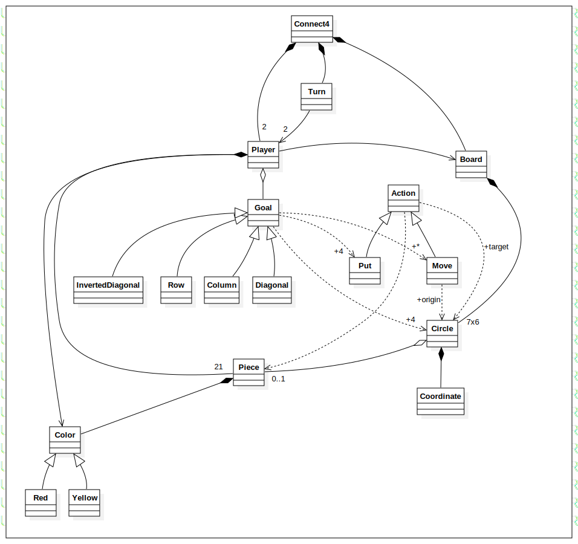

# Modela diagramas de los juegos Conecta-4 y Klondike

Modela diagramas de los juegos Conecta-4 y Klondike (Solitario de Windows). Debe incluir un diagrama de clases y, si lo ves necesario, un diagrama de objetos que exprese el estado del juego en un momento dado, por ejemplo el estado del juego del Klondike al inicio o al final de la partida. No hay que abusar de los diagramas de objetos, así que daremos prioridad a los diagramas de clases y los de objetos solamente se presentarán si se cree que es esencial para entender el juego.

## Conecta-4
Aqui mi propuesta de vocabulario para el juego Conecta-4

<picture>
    
</picture>

## Klondike 
Aqui mi propuesta de vocabulario para el juejo de Klondike

<picture>
    
</picture>
